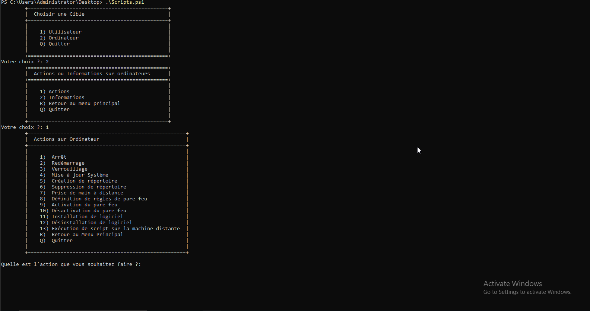
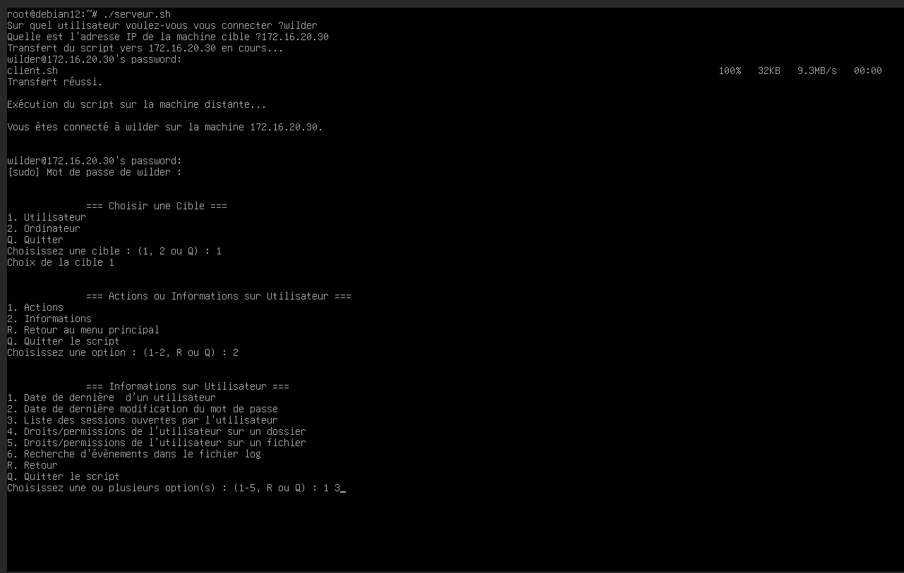
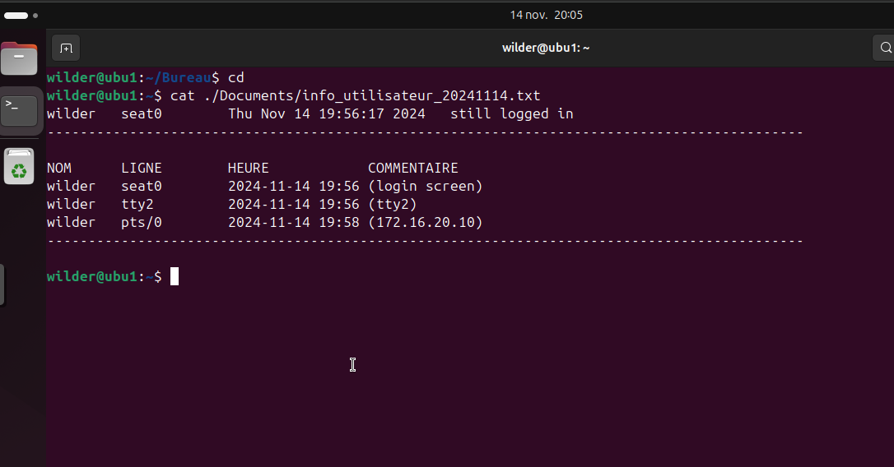
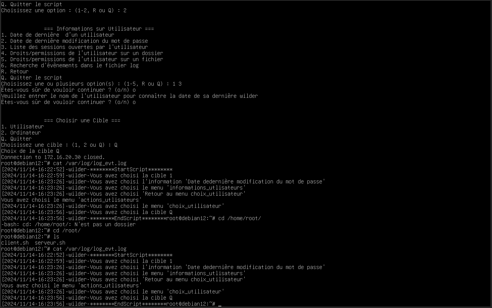

# Documentation Utilisateur

1. [Utilisation de base](#1-utilisation-de-base) \
            1. [Script BASH SHELL]
            2. [Script Powershell]
2. [Comment utiliser les fontionnalités clés](#2-comment-utiliser-les-fontionnalités-clés) \
            1. [Utilisation du script](#1-utilisation-du-script)
3. [Comment utiliser au mieux les options](#3-comment-utiliser-au-mieux-les-options)
4. [FAQ](#4-faq)
            

# 1. Utilisation de base
      1. Script Bash shell

      2. Script Powershell

  
  
# 2. Comment utiliser les fontionnalités clés

 Il vous suffit de lancer le script et de naviguer sur les differents menus. Pour chaque action et/ou information demandée, le script vous affichera l'information ou exécutera l'action choisie.
 
 

# 3. Comment utiliser au mieux les options

Le script vous permet des fonctionnalités avancées comme par exemple une requête de plusieurs informations.

Si vous vous rendez , dans un menu information, et que vous choissisez les informations 1 et 3. (Fonctionne uniquement pour le script bash 14/11/2024)

 

Vous retrouverez les informations dans un fichier .txt dans le dossier `C:\Users\<Nom_utilisateur>\Documents\` ou `/home/<Nom_utilisateur>/Documents`

 

Cela vous permet de consulter les informations produites par le script et de faire une seule requête d'informations.

Vous pouvez également consulter le journal du script, afin de retracer toutes vos actions effectuées dans le script. Il vous aidera notammment pour comprendre les potentielles erreurs. 

Ce journal se créée à la première exécution de votre script et contient un horodatage ainsi que l'utilisateur et un message. Chaque session d'execution sera bornée par un "********StartScript********" et un "********EndScript********".

Il est situé dans `C:\Windows\System32\LogFiles` sur Windows et dans `/var/log/` pour une distribution GNU/Linux. 

# 4. FAQ
## Q: Mon script ne marche pas ? Que faire ?
## A: Vérifiez tout d'abord si votre machine est à jour. 
- Sous GNU/Linux :
Dans votre console tapez `sudo apt update && sudo apt upgrade `
- Sous Windows :
Clic gauche Menu Windows et tapez ` Mise à jour ` puis sélectionnez la première option et cliquez sur la recherche de mise à jour. 

Le cas échéant, vérifiez que vous possédez toutes les permissions requises à la bonne exécution du script. 

- Sous GNU/Linux :
Dans votre console tapez `sudo bash /chemin/script.sh `
- Sous Windows :
Clic droit sur la console Powershell puis sélectionnez ` Exécutez en tant qu'administrateur`

Si les problèmes persistent supprimez et retéléchargez le script.

## Q: J'ai une erreur de connexion quand je veux me connecter sur la machine distante, que faire ? 
## A: C'est probablement une erreur d'adresse.
Vérifiez bien que vous choissisez la bonne adresse IP de la machine distante. La machine cliente doit être, dans notre cas, sur le même réseau que la machine serveur. Attention si vous avez plusieurs interfaces réseaux, une erreur est vite arrivée !

## Q: Ma connexion à une machine distante est-elle sécurisée ? 
## A: Oui !
Windows et GNU/Linux proposent des moyens de connexions sécurisés permettant l'exécution d'action à distance en toute sécurité ! Nous utilisons une connexion [SSH](https://fr.wikipedia.org/wiki/Secure_Shell) pour les systèmes GNU/Linux, et une [connexion native](https://learn.microsoft.com/en-us/powershell/module/microsoft.powershell.core/invoke-command?view=powershell-7.4) de Microsoft Powershell pour les systèmes Windows. 

## Q: Rien ne s'affiche à l'écran, ma commande s'est elle bien exécutée ? 
## A: Dans ce cas, vous pouvez consulter le fichier de journalisation.
Que vous soyez sur Windows ou une distribution GNU/Linux, un fichier de journalisation recueille les différentes actions effectuées dans le script. C'est la première action à faire en cas de doute. 
- Sous GNU/Linux :
`/var/log/log_evt.log`
- Sous Windows :
`C:\Windows\System32\LogFiles\log_evt.log`
À partir de ce fichier vous pourrez déterminer si oui ou non un problème est apparu.

